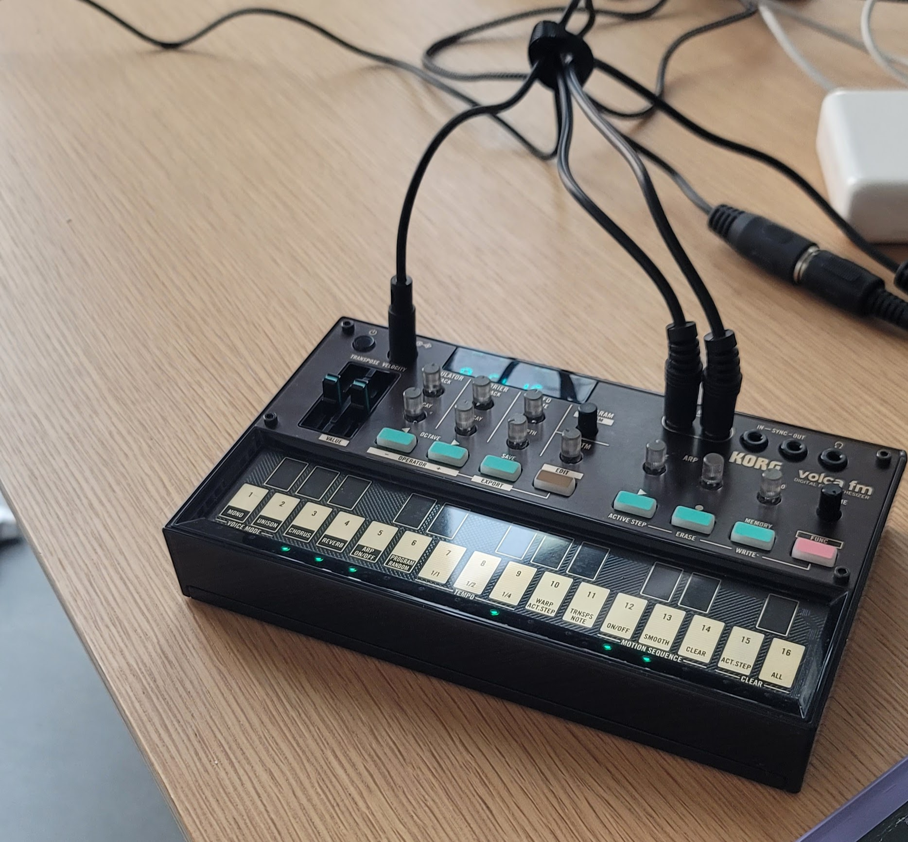

# Rhythms - Python MIDI Demos

A collection of Python-based MIDI demos showcasing different approaches to MIDI programming and synthesis. Features demonstrations of FM synthesis and MIDI playback using Python.

## Requirements

- Python 3.10+
- MIDI device (optional, but recommended for full experience)
- Virtual MIDI port (if no physical MIDI device is available)

## Installation

1. Clone the repository:
```bash
git clone git@github.com:octaflop/rhythms.git
cd rhythms
```

2. Create and activate a virtual environment:
```bash
python -m venv venv
source venv/bin/activate  # On Windows use: venv\Scripts\activate
```

3. Install dependencies:
```bash
pip install -r requirements.txt
```

## Demos

### 1. FM Synthesizer (`fm_synth.py`)
A minimal FM synthesizer that responds to MIDI input in real-time.

```bash
python -m demos.midis.fm_synth
```

### 2. Monty Python Theme Player
Two variations of the Monty Python theme (The Liberty Bell March):

- Basic version (`monty_midi.py`):
```bash
python -m demos.midis.monty_midi
```

- Enhanced version with multiple tracks (`monty_midi_track.py`):
```bash
python -m demos.midis.monty_midi_track
```

### 3. MIDI Recorder/Player (`many_midis.py`)
An interactive MIDI tool that can:
- Play a default melody
- Record MIDI input
- Play back recorded melodies

```bash
python -m demos.midis.many_midis
```

## Features

- Real-time FM synthesis
- MIDI input/output handling
- Multiple instrument tracks
- MIDI recording and playback
- Automatic MIDI port detection

## Usage Notes

1. When running any of the demos, you'll be prompted to select a MIDI output port if multiple options are available.
2. For the FM synth demo, ensure you have a MIDI input device connected.
3. The Monty Python demos are optimized for the Korg Volca series but will work with any MIDI-compatible device.

## Dependencies

Key packages:
- mido: MIDI Objects for Python
- numpy: Numerical computations
- sounddevice: Audio output